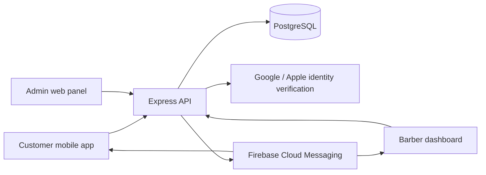
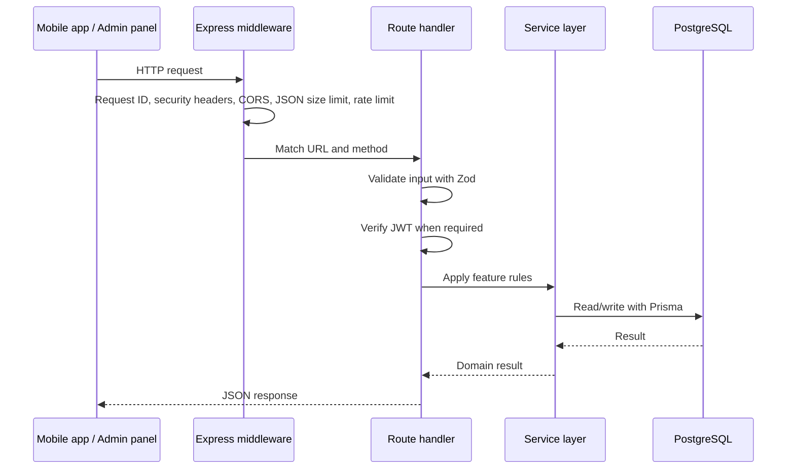
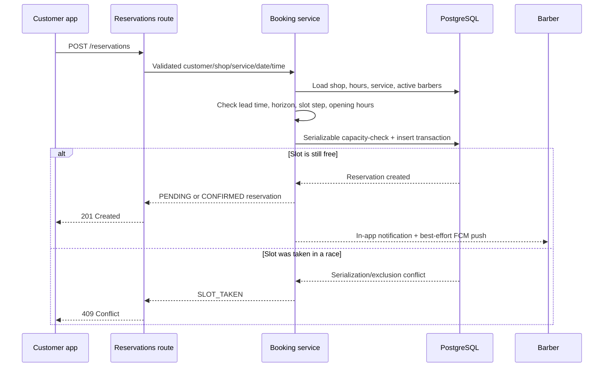
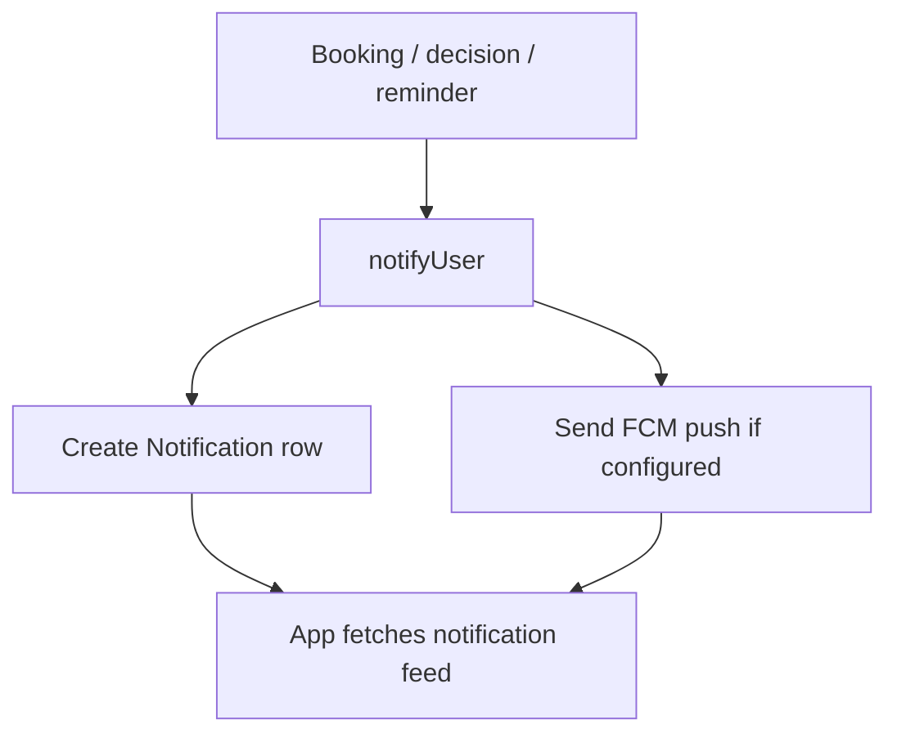
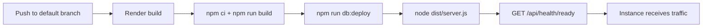

# Maqast Backend Guide

This guide explains the server behind Maqast in plain language. It is for a
developer who is new to the project and wants to understand what the backend
does, where to make a change, how to run it safely, and how it stays reliable.

The backend is in this repository. It powers:

- the Flutter customer app;
- the barber dashboard inside the Flutter app;
- the React admin panel; and
- push notifications and appointment reminders.

> **New here? Two suggested paths.**
>
> - *Learn by doing:* set up locally (§4), then follow
>   [§8b — Try it yourself](#8b-try-it-yourself-one-booking-end-to-end). It walks
>   a booking from sign-in to confirmation with real commands and real responses,
>   and most of this guide will make sense afterwards.
> - *Learn by reading:* §1 → §2 → §3 for the shape of the system, then §7
>   (auth) and §9 (booking) for the parts that carry the most rules.
>
> Unfamiliar words are defined in the [glossary](#18-glossary).

## 1. The short version

The server is a **Node.js + TypeScript** application using **Express**. It
stores data in **PostgreSQL** through **Prisma**.



In practical terms, the server accepts an HTTP request such as “show shops”,
“create booking”, or “accept appointment”, checks that it is valid and allowed,
reads or writes the database, and returns JSON to the app.

## 2. Repository map

| Location | Purpose |
| --- | --- |
| `src/server.ts` | Starts the HTTP server and controls graceful shutdown. |
| `src/app.ts` | Builds Express, registers security middleware, health checks, and routes. |
| `src/routes/` | HTTP endpoints grouped by feature. Start here when adding an API endpoint. |
| `src/services/` | Business rules that are too important or complex to live in a route. |
| `src/lib/` | Reusable infrastructure: Prisma, JWTs, logging, push, notifications, audit records. |
| `src/middleware/` | Authentication, request validation, rate limits, and error responses. |
| `prisma/schema.prisma` | Database model in Prisma syntax. |
| `prisma/migrations/` | Immutable SQL history for database changes. |
| `prisma/seed.ts` | Optional demo/development data. |
| `tests/` | API, barber-flow, and infrastructure tests. |
| `render.yaml` | Render deployment blueprint. |
| `.env.example` | Safe template for local environment variables. |

### A useful rule of thumb

When changing a feature, trace it in this order:

```text
Route → validation/auth middleware → service → Prisma/database → response shape → tests
```

For example, a booking is received in `src/routes/reservations.ts`, handled by
`src/services/booking.ts`, stored through the `Reservation` Prisma model, then
serialized back to the mobile app.

## 3. How a request travels through the server

Every request follows approximately the same path.



The setup order is in `src/app.ts`:

1. **Request logging** gives each request a traceable log entry. Authorization
   and cookie headers are redacted before logging.
2. **Helmet** adds browser-facing security headers.
3. **CORS** accepts browser requests only from `CORS_ORIGINS`.
4. **Compression** gzip-compresses responses where useful.
5. **JSON parsing** rejects bodies over 256 KB.
6. **Rate limiting** limits abusive traffic.
7. **Routes** handle feature-specific work.
8. **Error middleware** turns expected errors into consistent JSON and hides
   unexpected internal details.

## 4. Starting the server locally

### Prerequisites

- Node.js 20 or newer
- PostgreSQL 16 (or a compatible local Postgres)
- npm

### Setup

```bash
cd /Users/roomi/Documents/brb/brb-backend
npm ci
cp .env.example .env
```

Set `DATABASE_URL` in `.env` to a local database. A typical value is:

```dotenv
DATABASE_URL="postgresql://postgres@localhost:5432/barberapp?schema=public"
```

Apply migrations, optionally add seed data, and start the dev server:

```bash
npm run db:deploy
npm run db:seed
npm run dev
```

The default local address is `http://localhost:4000`.

Check that it is alive:

```bash
curl http://localhost:4000/api/health
curl http://localhost:4000/api/health/ready
```

### Development-only login

When `NODE_ENV` is not `production`, `POST /api/auth/test-login` exists to make
local testing easier. It can create/sign in as any email with no credential.

**Never use a non-production build against production data.** The route is not
registered in production and there is intentionally no configuration flag to
turn it on.

## 5. Environment variables

Copy `.env.example` for the full list. These are the most important variables.

| Variable | What it controls |
| --- | --- |
| `DATABASE_URL` | PostgreSQL connection string. Required. |
| `NODE_ENV` | Set to `production` on Render. Enables production safeguards. |
| `JWT_ACCESS_SECRET` | Signs customer and barber access tokens. |
| `JWT_ADMIN_SECRET` | Separately signs admin-panel tokens. Must differ from the customer secret in production. |
| `GOOGLE_CLIENT_ID` | Comma-separated accepted Google ID-token audiences. |
| `APPLE_CLIENT_ID` | Accepted Apple token audiences; defaults to the app bundle ID. |
| `CORS_ORIGINS` | Comma-separated browser origins allowed to call the API. |
| `FIREBASE_SERVICE_ACCOUNT` | Firebase service-account JSON for push notifications. Optional. |
| `DB_CONNECTION_LIMIT` | Prisma connection pool size. Defaults to 5. |
| `DB_POOL_TIMEOUT` | Seconds Prisma waits for a pooled DB connection. Defaults to 10. |
| `DB_STATEMENT_TIMEOUT_MS` | Database query limit in milliseconds. Defaults to 15000. |
| `LOG_LEVEL` | Pino logging level, such as `info` or `warn`. |

Generate a secret using:

```bash
openssl rand -hex 32
```

In production, the server refuses to start if either JWT secret is missing,
uses a known development placeholder, or if both secrets are the same.

## 6. The database

PostgreSQL is the source of truth. Prisma provides typed database access from
TypeScript. The full model is in `prisma/schema.prisma`.

### Main tables/models

| Model | What it represents |
| --- | --- |
| `User` | A customer or barber’s signed-in account. A barber is still a user; their email also matches a `Barber` row. |
| `AdminUser` | A separate administrator account with a password hash. |
| `RefreshToken` | A hashed long-lived session token. The raw token is never stored. |
| `City` | A city containing barbershops. |
| `Barbershop` | Shop profile, location, opening rules, visibility, ratings, and subscription. |
| `Service` | A service offered by a shop, with duration and price. |
| `OpeningHour` | A shop’s hours for one weekday. |
| `Barber` | A barber working in one shop, including auto-approve settings and lifetime totals. |
| `Reservation` | An appointment: customer, shop, service, barber, time interval, price snapshot, and status. |
| `Review` | One customer’s review of one shop. |
| `Notification` | In-app notification feed entry. |
| `DeviceToken` | Firebase token for one device. |
| `Plan` / `Subscription` | Admin-managed commercial plan and a shop’s current subscription. |
| `AuditLog` | Immutable record of a state-changing admin action. |

### Important database design decisions

- Prices and appointment end times are copied into `Reservation` at booking
  time. A later price/service edit must not alter historic earnings.
- Shop rating is stored as `ratingAvg` and `ratingCount` for fast list sorting;
  review writes recalculate it in the same transaction.
- `PENDING` and `CONFIRMED` reservations both occupy a time slot.
- A Postgres exclusion constraint prevents two active reservations from
  overlapping for the same barber, even if future application code makes a
  mistake.
- Customer deletion removes that customer’s booking rows as promised by the
  privacy policy. If those rows were historic completed barber work, only
  anonymous aggregate totals are carried into the barber’s `archivedCuts` and
  `archivedEarnings` fields.

### Migrations: the safe way to change the schema

Never edit an already-applied migration. Add a new one instead.

For local development:

```bash
npm run db:migrate
```

Prisma creates a new migration under `prisma/migrations/`. Review the SQL,
commit it with the schema change, and let Render run `npm run db:deploy` before
the new application version starts.

## 7. Authentication and roles

There are three server-side identities.

| Identity | How it signs in | What it can do |
| --- | --- | --- |
| Customer | Google or Apple ID token | Browse, book, cancel, review, manage own account. |
| Barber | Same Google/Apple flow; email must match a `Barber` row | Customer permissions plus barber dashboard endpoints. |
| Administrator | Email + password | Manage shops, plans, subscriptions, featured shops, and audit history. |

### Customer/barber sign-in

1. The mobile app obtains an identity token from Google or Apple.
2. It sends that token to `POST /api/auth/google` or `POST /api/auth/apple`.
3. The server verifies token signature, issuer, audience, and email rules with
   the provider.
4. The server finds or creates `User` and returns:
   - a short-lived access JWT (default 15 minutes); and
   - an opaque refresh token (default 30 days).
5. The mobile app sends the access JWT as `Authorization: Bearer <token>`.

The access token’s `aud` is `barber-api`. The refresh token is random and only
its SHA-256 hash is stored. Refresh-token rotation detects reuse and revokes
the affected token family.

### Admin sign-in

`POST /api/admin/login` checks a bcrypt password hash and returns an admin JWT.
Admin tokens have a different audience (`barber-admin`) and use
`JWT_ADMIN_SECRET`, not the customer secret. A customer JWT cannot be used at
an admin route.

### Middleware to know

| Middleware | File | Meaning |
| --- | --- | --- |
| `requireUser` | `src/middleware/auth.ts` | Requires a valid customer/barber access token. |
| `requireAdmin` | `src/middleware/auth.ts` | Requires a valid admin token. |
| `validate` | `src/middleware/validate.ts` | Parses body/query values with a Zod schema and returns 400 on invalid input. |
| `generalLimiter` | `src/middleware/rateLimit.ts` | Limits general API traffic. |
| `authLimiter` | `src/middleware/rateLimit.ts` | Stricter limit around customer sign-in. |
| `adminLoginLimiter` | `src/middleware/rateLimit.ts` | Stronger limit around admin passwords. |

For authenticated endpoints, rate limiting keys on the verified user ID. Before
authentication, it falls back to client IP. This avoids a mobile carrier NAT
making unrelated signed-in users share one limit.

## 8. API overview

All endpoints begin with `/api`. Responses are JSON.

An error uses this shape:

```json
{
  "error": {
    "code": "SLOT_TAKEN",
    "message": "That time is no longer available"
  }
}
```

### Health

| Method | Path | Purpose |
| --- | --- | --- |
| GET | `/health` | Is the Node process alive? No database access. |
| GET | `/health/ready` | Should a load balancer send traffic here? Checks DB and drain status. |

### Authentication (`src/routes/auth.ts`)

| Method | Path | Purpose |
| --- | --- | --- |
| POST | `/auth/google` | Sign in/up with Google ID token. |
| POST | `/auth/apple` | Sign in/up with Apple identity token. |
| POST | `/auth/refresh` | Exchange a valid refresh token for a rotated token pair. |
| POST | `/auth/logout` | Revoke a refresh token. |
| GET | `/auth/me` | Read signed-in user profile. |
| PATCH | `/auth/me` | Update signed-in user profile. |
| DELETE | `/auth/me` | Delete signed-in user account/data. |

### Public catalogue (`src/routes/catalog.ts`)

| Method | Path | Purpose |
| --- | --- | --- |
| GET | `/cities` | List cities. |
| GET | `/shops` | Search/paginate visible live shops. |
| GET | `/shops/of-the-week` | Curated featured shops. Cached briefly. |
| GET | `/shops/nearby` | Nearby live shops from latitude/longitude. |
| GET | `/shops/:id` | Shop details. |
| GET | `/shops/:id/availability` | Available time slots for a service and day. |
| GET | `/shops/:id/reviews` | Paginated shop reviews. |

Reviews are written through one endpoint, which lives in `src/routes/reviews.ts`
(not `catalog.ts`) because it is the only write in this group and it requires a
signed-in user:

| Method | Path | Purpose |
| --- | --- | --- |
| PUT | `/shops/:id/review` | Create/replace the signed-in user’s review. Requires a completed visit. |

`/shops/nearby` first applies a database-friendly latitude/longitude bounding
box, then calculates the exact great-circle distance (Haversine) and returns
the nearest matching results. It avoids downloading the full shop catalogue to
the phone.

### Reservations (`src/routes/reservations.ts`)

| Method | Path | Purpose |
| --- | --- | --- |
| POST | `/reservations` | Create a booking. |
| GET | `/reservations/mine?scope=upcoming\|past` | List caller’s bookings. |
| POST | `/reservations/:id/cancel` | Cancel caller’s booking when policy permits. |

### Barber dashboard (`src/routes/barber.ts`)

| Method | Path | Purpose |
| --- | --- | --- |
| GET | `/barber/me` | Determine whether the signed-in user is a barber. |
| PATCH | `/barber/auto-approve` | Enable/disable automatic confirmation. |
| GET | `/barber/stats` | Barber’s appointments and earnings statistics. |
| GET | `/barber/today` | Today’s appointments. |
| GET | `/barber/requests` | Pending booking requests. |
| GET | `/barber/customers` | Customers with completed visits. |
| POST | `/barber/reservations/:id/accept` | Confirm a pending request. |
| POST | `/barber/reservations/:id/decline` | Decline a pending request. |

### Notifications (`src/routes/notifications.ts`)

| Method | Path | Purpose |
| --- | --- | --- |
| POST | `/notifications/device` | Register/update the current device’s Firebase token and language. |
| POST | `/notifications/device/unregister` | Remove a device token at logout. |
| GET | `/notifications` | Read the in-app notification feed and unread count. |
| POST | `/notifications/read` | Mark caller’s notifications as read. |

### Admin (`src/routes/admin.ts`)

All paths below begin with `/api/admin`; all except `/login` require an admin
token.

- `POST /login` — admin sign-in.
- `GET /summary` — dashboard counts.
- `GET`/`POST /cities` — city management.
- `GET`/`POST /shops`, `GET`/`PATCH /shops/:id`, and
  `PATCH /shops/:id/visibility` — shop management.
- `GET`/`POST /plans`, `PATCH`/`DELETE /plans/:id` — plan management.
- `GET`/`POST /barber-of-week` — read/set featured shops and trigger a paced
  announcement.
- `PUT`/`DELETE /shops/:id/subscription` — set/remove a shop subscription.
- `GET /audit-logs` — read the admin audit record.
- `GET /reservations`, `GET /customers` — operations reporting.

## 8b. Try it yourself: one booking, end to end

Reading endpoint tables only gets you so far. This section walks the entire
life of a booking against a real server, using the seed data. Every response
below is **actual captured output**, trimmed for readability — not invented.

Start a seeded server first (this uses a throwaway database so nothing you care
about is touched):

```bash
createdb barberapp_docs
export DATABASE_URL="postgresql://postgres@localhost:5432/barberapp_docs?schema=public"
npm run db:deploy && npm run db:seed && npm run dev
```

The seed prints the accounts it created:

```text
Admin login: admin@barberapp.dev / admin1234
Demo customer: demo@barberapp.dev
Demo BARBER:   aland.kareem@barberapp.dev (Aland Kareem @ The Heritage Grooming Co.)
```

Throughout, `API=http://localhost:4000/api`.

### Step 1 — Sign in as a customer

In development only, `test-login` skips Google/Apple entirely:

```bash
curl -s -X POST $API/auth/test-login \
  -H 'Content-Type: application/json' \
  -d '{"email":"docs-reader@example.com","name":"Docs Reader"}'
```

```json
{
  "accessToken": "eyJhbGciOiJIUzI1NiIsInR5...",
  "refreshToken": "UFU3pcnEdNWw4VO1...",
  "isNewUser": true,
  "user": { "id": "cmst...", "email": "docs-reader@example.com", "name": "Docs Reader" }
}
```

Keep `accessToken`; send it as `Authorization: Bearer <token>` on every
authenticated call below.

### Step 2 — Find a shop

```bash
curl -s "$API/shops?pageSize=2"
```

```json
{
  "total": 3,
  "page": 1,
  "shops": [
    { "name": "The Heritage Grooming Co.", "ratingAvg": 5, "isFeatured": true,  "tierRank": 100000 },
    { "name": "Precision Cuts",            "ratingAvg": 5, "isFeatured": false, "tierRank": 50000 }
  ]
}
```

Note `isFeatured` and `tierRank`: paying shops sort first across the **whole**
list, not just within one page. That is the paid tier's entire value, so it is
done in the database query rather than by re-sorting a page in the app.

If you have a coordinate, `/shops/nearby` does the distance work server-side:

```bash
curl -s "$API/shops/nearby?lat=35.5613&lng=45.4408&radiusKm=5&limit=2"
```

```json
[
  { "name": "The Heritage Grooming Co.", "distanceMeters": 706, "tierRank": 100000 },
  { "name": "Apex Barbers",              "distanceMeters": 789, "tierRank": 25000 }
]
```

### Step 3 — Pick a service

```bash
curl -s "$API/shops/$SHOP_ID"
```

```json
{
  "name": "The Heritage Grooming Co.",
  "chairCount": 3,
  "services": [
    { "name": "Beard Trim & Shape",   "durationMin": 20, "price": 8000,  "isStandard": false },
    { "name": "Classic Haircut",      "durationMin": 30, "price": 15000, "isStandard": false },
    { "name": "Haircut & Beard Trim", "durationMin": 45, "price": 20000, "isStandard": true }
  ],
  "barbers": [ { "name": "Aland Kareem" }, { "name": "Hemin Aziz" }, { "name": "Rebin Salih" } ]
}
```

Exactly one service per shop has `isStandard: true`. That is the combo the
app's Quick Booking preselects, which is why every shop is guaranteed to have
one.

### Step 4 — See free times

```bash
curl -s "$API/shops/$SHOP_ID/availability?date=2026-08-16&serviceId=$SERVICE_ID"
```

```json
{
  "date": "2026-08-16",
  "slots": [
    { "startMinute": 600, "startsAt": "2026-08-16T07:00:00.000Z" },
    { "startMinute": 615, "startsAt": "2026-08-16T07:15:00.000Z" },
    { "startMinute": 630, "startsAt": "2026-08-16T07:30:00.000Z" }
  ]
}
```

Two fields for the same instant, on purpose:

- `startMinute` is **minutes from local midnight at the shop** (600 = 10:00 AM).
  This is what you send back when booking.
- `startsAt` is the absolute UTC instant, for display.

The shop stores a fixed `utcOffsetMinutes` (Iraq is UTC+3, no daylight saving),
so the two convert cleanly without a timezone library.

### Step 5 — Book it

```bash
curl -s -X POST $API/reservations \
  -H "Authorization: Bearer $TOKEN" -H 'Content-Type: application/json' \
  -d '{"shopId":"'$SHOP_ID'","serviceId":"'$SERVICE_ID'","date":"2026-08-16","startMinute":600}'
```

`HTTP 201`:

```json
{
  "reservation": {
    "id": "cmstckfky000bi48dyy4egply",
    "status": "PENDING",
    "startsAt": "2026-08-16T07:00:00.000Z",
    "barber": "Aland Kareem",
    "service": "Haircut & Beard Trim"
  }
}
```

You never chose a barber — the server assigned the first free one. Status is
`PENDING` because that barber does not have auto-approve on. Had they enabled
it, this would come back `CONFIRMED` immediately.

### Step 6 — Watch a rule fire

Book again without cancelling:

`HTTP 409`:

```json
{ "error": { "code": "ONE_ACTIVE_BOOKING",
             "message": "You already have an active booking. Cancel it before booking again." } }
```

Send a malformed date — `HTTP 400`:

```json
{ "error": { "code": "VALIDATION", "message": "date: Expected YYYY-MM-DD" } }
```

Drop the token — `HTTP 401`:

```json
{ "error": { "code": "UNAUTHORIZED", "message": "Authentication required" } }
```

Every failure has the same envelope: a stable machine-readable `code` the app
branches on, and a human `message`. **Branch on `code`, never on `message`** —
messages are localized and reworded, codes are the contract.

### Step 7 — Become the barber

```bash
curl -s -X POST $API/auth/test-login -d '{"email":"aland.kareem@barberapp.dev"}' ...
curl -s "$API/barber/me" -H "Authorization: Bearer $BARBER_TOKEN"
```

```json
{ "isBarber": true, "name": "Aland Kareem",
  "shop": "The Heritage Grooming Co.", "autoApprove": false }
```

There is no separate barber login. A barber signs in exactly like a customer;
the dashboard unlocks because their account email also matches a `Barber` row.

```bash
curl -s "$API/barber/requests" -H "Authorization: Bearer $BARBER_TOKEN"
```

```json
[
  { "id": "cmstckfky...", "customerName": "Docs Reader", "serviceName": "Haircut & Beard Trim",
    "startsAt": "2026-08-16T07:00:00.000Z", "price": 20000 }
]
```

### Step 8 — Accept it

```bash
curl -s -X POST "$API/barber/reservations/$RESERVATION_ID/accept" \
  -H "Authorization: Bearer $BARBER_TOKEN"
```

```json
{ "reservation": { "id": "cmstckfky...", "status": "CONFIRMED" } }
```

Accept the same one twice and the second attempt is refused — `HTTP 400`:

```json
{ "error": { "code": "ALREADY_DECIDED", "message": "This request was already handled" } }
```

That is the compare-and-swap guard: the decision only lands while the row is
still `PENDING`, so a cancelled booking can never be resurrected by a late tap.

### Step 9 — The customer hears about it

Back as the customer:

```bash
curl -s "$API/notifications" -H "Authorization: Bearer $TOKEN"
```

```json
{
  "unread": 1,
  "notifications": [
    { "type": "BOOKING_ACCEPTED", "title": "Booking confirmed",
      "body": "Aland Kareem confirmed your Haircut & Beard Trim at The Heritage Grooming Co..",
      "read": false }
  ]
}
```

The feed row is written to the database **and** a push is attempted. The row is
the source of truth; the push is best effort. If Firebase is unconfigured or
the device is unreachable, the customer still sees this next time they open the
app.

### Step 10 — Peek at the admin side

```bash
curl -s -X POST $API/admin/login \
  -d '{"email":"admin@barberapp.dev","password":"admin1234"}' ...
curl -s "$API/admin/summary" -H "Authorization: Bearer $ADMIN_TOKEN"
```

```json
{ "shops": 3, "liveShops": 3, "users": 4, "upcomingReservations": 1, "plans": 3 }
```

Now try the customer token on that same admin route — `HTTP 401`:

```json
{ "error": { "code": "TOKEN_INVALID", "message": "Invalid or expired token" } }
```

Not `403`. The two token types are signed with **different secrets and
audiences**, so a customer token does not fail a role check — it fails
verification outright and never reaches one.

### Clean up

```bash
dropdb barberapp_docs
```

---

## 9. The booking flow: the most important part

Bookings deserve special care because two people may choose the same time at
the same moment.



The rules in `src/services/booking.ts` include:

- booking times must align to 15-minute slots;
- booking must be at least 30 minutes in the future;
- booking can be at most 30 days ahead;
- it must fall inside the shop’s opening hours;
- it respects service duration and the shop’s buffer time;
- a request for a named barber can only use that active barber;
- “any barber” selects an eligible free barber;
- pending and confirmed bookings both prevent double booking;
- customer cancellation closes two hours before the appointment.

### Why double booking is prevented twice

The service performs the capacity check and insert inside a PostgreSQL
**Serializable** transaction. If two transactions race, it retries a few times.

There is also a Postgres **exclusion constraint** for barber-backed bookings.
That database constraint is the final safety net: even a future code path that
forgets the service rule cannot create overlapping active appointments for the
same barber.

If the retry limit is reached, the user receives a friendly HTTP 409
`SLOT_TAKEN`, not an internal-server error.

## 10. Notifications and real-time behaviour

The database notification feed is the durable source of truth. Firebase push is
best effort: it improves immediacy, but an unavailable device must not make a
booking fail.



- A new booking produces a barber `NEW_RESERVATION` notification.
- Barber accept/decline produces a customer notification.
- The reminder job sends a reminder about 20 minutes before a confirmed
  appointment.
- Invalid/stale Firebase device tokens are removed automatically after Firebase
  reports them invalid.

The mobile barber dashboard also refreshes its request list from push, on app
resume, and on a short foreground polling interval. This prevents a new
appointment from depending on a manual swipe-to-refresh when a push is delayed
or notifications are disabled.

## 11. Background work

The server runs two small scheduled jobs in the web process.

### Appointment reminders

`src/services/reminders.ts` runs once per minute. It finds confirmed
appointments beginning within roughly 20 minutes, then claims each row by
updating it only when `reminderSentAt` is still null.

That compare-and-swap claim makes it safe if two server instances run the sweep:
only one can send a reminder for a reservation.

### Retention

`src/services/maintenance.ts` first runs five minutes after boot, then every
six hours. It removes:

- expired refresh tokens;
- old in-app notifications (default 90 days); and
- old audit entries (default 365 days).

Deletion is chunked. This avoids a large table cleanup monopolising the
database or the API process.

### Barber of the Week broadcast

The admin feature writes in-app announcement rows in batches, then sends FCM
pushes in smaller, delayed batches with jitter. This deliberately prevents a
large announcement from causing thousands of users to reopen the app in the
same second.

## 12. Security measures already in place

| Measure | Why it matters |
| --- | --- |
| Helmet + no `X-Powered-By` | Reduces avoidable HTTP/browser information exposure. |
| CORS allowlist | Limits browser API callers to known origins. |
| 256 KB JSON cap | Avoids oversized-body memory abuse. |
| Input schemas (Zod) | Rejects malformed input before business logic/database access. |
| Rate limits | Slows abuse and costly sign-in attempts. |
| Separate JWT secrets/audiences | A customer token cannot become an admin token. |
| Hashed refresh tokens | A database leak does not reveal usable refresh tokens. |
| Request-log redaction | Authorization and cookie values do not enter logs. |
| Admin audit trail | Sensitive admin changes have accountability. |
| Database booking constraint | Prevents double booking at the final persistence layer. |

### Important operational security rules

- Keep all secrets in Render environment variables, never in Git.
- Never enable/test a non-production build against real data.
- Set `CORS_ORIGINS` to the actual deployed admin-site origin(s), not `*`.
- Rotate `JWT_ADMIN_SECRET` if an admin session/token may have leaked. Doing so
  signs all admins out but does not affect customer sessions.
- Review audit logs after subscription, plan, or visibility disputes.

## 13. Availability and deployment

Render uses `render.yaml` to build and run the service.



### Why migrations run before startup

`preDeployCommand` runs `prisma migrate deploy` once before the new instance
starts. A failed migration stops the release before it serves traffic. Running
migrations in every process startup can cause lock contention and crash loops
when more than one instance starts.

### Health checks

- `GET /api/health` is **liveness**: “is Node alive?” It never checks the DB.
- `GET /api/health/ready` is **readiness**: “should this instance receive new
  traffic?” It checks DB availability and whether the process is draining.

### Graceful shutdown

During a deploy or platform stop, `src/server.ts`:

1. marks the app as draining, which makes readiness return 503;
2. stops scheduled/background work;
3. gives the load balancer a short time to stop routing new work;
4. closes the listener and lets active requests finish;
5. disconnects Prisma and exits.

An uncaught exception or unhandled promise rejection uses the same controlled
shutdown, exiting non-zero so Render replaces the process rather than letting
it continue in an unknown state.

### Current scaling limits

The Render blueprint intentionally starts on a single Starter web service and
a Basic 256 MB Postgres database. It is appropriate for low/early production
traffic, but it is not automatically horizontally scalable.

Before using multiple instances:

1. Replace the in-memory rate-limit store with a shared Redis-backed store.
2. Recalculate database connections: each instance has its own Prisma pool.
3. Upgrade the database in step with total connections and workload.
4. Use Render’s required plan/workspace level for autoscaling.

See `DEPLOYMENT.md` for plan notes and the operational checklist.

## 14. Logs, errors, and debugging

The server writes structured JSON logs through Pino. Render captures standard
output, so use the Render service logs to investigate incidents.

### How errors are returned

Use `ApiError` in `src/lib/errors.ts` for expected client-facing failures:

| Status | Typical meaning |
| --- | --- |
| 400 | Invalid input or an invalid booking choice. |
| 401 | Missing, invalid, or expired authentication token. |
| 403 | Authenticated but not allowed. |
| 404 | Resource/end point not found. |
| 409 | Race/conflict, such as `SLOT_TAKEN`. |
| 429 | Rate limit reached. |
| 503 / 504 | A dependency is unavailable or too slow; retry later. |
| 500 | Unexpected server error. Full details stay in the server log, not the response. |

### First checks for common problems

| Symptom | Check |
| --- | --- |
| Render deploy will not become live | Open `/api/health/ready` and logs; verify DB and required environment variables. |
| Every login fails | Check `GOOGLE_CLIENT_ID`, token audience, and that production is not using the placeholder. |
| Admin panel gets 401 | The admin needs to sign in again; check `JWT_ADMIN_SECRET` and panel API base URL. |
| Push is not delivered | Check `FIREBASE_SERVICE_ACCOUNT`, device registration, OS permission, and Firebase logs. The in-app feed should still work. |
| Booking is rejected as taken | This is normally correct: another booking won a race or the slot is occupied. Refresh availability. |
| Database connection timeouts | Check DB plan/load and `DB_CONNECTION_LIMIT`; do not simply raise it without considering total DB capacity. |

## 15. Testing safely

Tests use a real PostgreSQL database and **reset it destructively**.

```bash
cd /Users/roomi/Documents/brb/brb-backend
DATABASE_URL="postgresql://postgres@localhost:5432/barberapp_test?schema=public" npm test
```

The `pretest` script refuses to run unless the database name contains `test`.
That guard exists to prevent someone from wiping a development or production
database with `prisma migrate reset`.

The suite covers API behavior, barber flows, and infrastructure/safety behavior.
Run it whenever changing routes, booking, auth, database schema, or deployment
logic.

For a build-only check:

```bash
npm run build
```

## 16. How to add a feature safely

Suppose you want to add “favourite barbershops.” A safe sequence is:

1. **Design data:** add a `FavoriteShop` model and useful indexes in
   `prisma/schema.prisma`.
2. **Create migration:** run `npm run db:migrate`; inspect the generated SQL.
3. **Validate input:** add Zod schemas for any request body/query.
4. **Add routes:** create or extend an appropriate router in `src/routes/`.
5. **Add business rules:** put ownership/edge-case logic in `src/services/` if
   it is more than a simple query.
6. **Authorize:** use `requireUser` or `requireAdmin` where appropriate.
7. **Return stable JSON:** avoid exposing internal columns accidentally.
8. **Test:** add happy-path, unauthorised, invalid-input, and concurrency/edge
   tests as appropriate.
9. **Update clients:** add the repository call in the Flutter app and use it in
   the UI.
10. **Deploy:** commit schema + migration + code together; Render runs the
    migration before the release starts.

### Things to avoid

- Do not put database writes directly in many unrelated routes; centralize
  sensitive rules such as booking in a service.
- Do not trust client-provided user IDs; use `req.auth.userId` after JWT
  middleware.
- Do not add a database migration only to your local DB and forget to commit
  it.
- Do not swallow errors around a core write just to make a request “succeed.”
  Best-effort behavior is appropriate for notifications, not for reservations.
- Do not use `Promise.all` for dependent writes that must succeed/fail together;
  use a Prisma transaction.

## 17. Where to read next

For a first code-reading session, this order is approachable:

1. `src/app.ts` — the whole HTTP application in one file.
2. `src/routes/catalog.ts` — simple public reads.
3. `src/routes/reservations.ts` and `src/services/booking.ts` — the main
   business flow.
4. `src/routes/auth.ts` and `src/lib/jwt.ts` — sessions and identity.
5. `prisma/schema.prisma` — the data model.
6. `src/server.ts` and `DEPLOYMENT.md` — operational behavior.

That progression gives you the project’s vocabulary before you reach the more
advanced concurrency, notification, and deployment details.

## 18. Glossary

Terms this guide uses that may be unfamiliar.

| Term | Plain-language meaning |
| --- | --- |
| **Endpoint / route** | One URL + method the server answers, e.g. `POST /api/reservations`. Defined in `src/routes/`. |
| **Middleware** | A function every request passes through before the route — logging, auth, validation, rate limiting. Order matters; see `src/app.ts`. |
| **JWT (access token)** | A short-lived signed string proving who you are. Sent as `Authorization: Bearer <token>`. Cannot be forged without the signing secret. |
| **Refresh token** | A long-lived random string used only to get a new access token. Stored hashed, so a database leak can't be replayed. |
| **Audience (`aud`)** | A field inside a JWT saying what it is for. Customer tokens say `barber-api`, admin tokens `barber-admin`, which is why one can't be used as the other. |
| **Rotation** | Each refresh burns the old refresh token and issues a new one. Reusing a spent one revokes the whole family — the signature of a stolen token. |
| **Prisma** | The library that turns TypeScript calls into SQL and gives typed results. The data model lives in `prisma/schema.prisma`. |
| **Migration** | A numbered SQL file recording one schema change. Applied in order, never edited after being applied. |
| **Transaction** | A group of database writes that all succeed or all fail. Used where a half-finished change would corrupt data. |
| **Serializable** | The strictest transaction isolation. If two overlap in a way that could produce an impossible result, one is aborted and retried — how double-booking is prevented. |
| **Exclusion constraint** | A Postgres rule rejecting rows that overlap. Here: one barber cannot hold two active bookings at the same time, enforced by the database itself. |
| **Idempotent** | Safe to repeat. Accepting an already-accepted request returns `ALREADY_DECIDED` rather than doing it twice. |
| **Compare-and-swap** | "Only change this row if it still looks how I last read it." Prevents overwriting a change someone else made in between. |
| **Denormalized** | A value copied for speed rather than recalculated, e.g. `ratingAvg`. Must be recomputed whenever its source changes. |
| **Liveness vs readiness** | Liveness = "is the process alive?" Readiness = "should it get traffic right now?" A failed readiness pulls the instance out of rotation without killing it. |
| **Draining** | Shutdown state: readiness starts failing so no new requests arrive, while requests already in flight finish. |
| **Zod** | The library that checks request bodies/queries and rejects bad input with a `VALIDATION` error before any business logic runs. |
| **FCM** | Firebase Cloud Messaging — Google's push delivery service. Optional here; without it the in-app feed still works. |
| **Seed** | Realistic sample data (`prisma/seed.ts`) for local development, created by `npm run db:seed`. |
| **CGNAT** | When a mobile carrier puts many customers behind one IP address. It's why rate limits key on user ID once you're signed in. |

